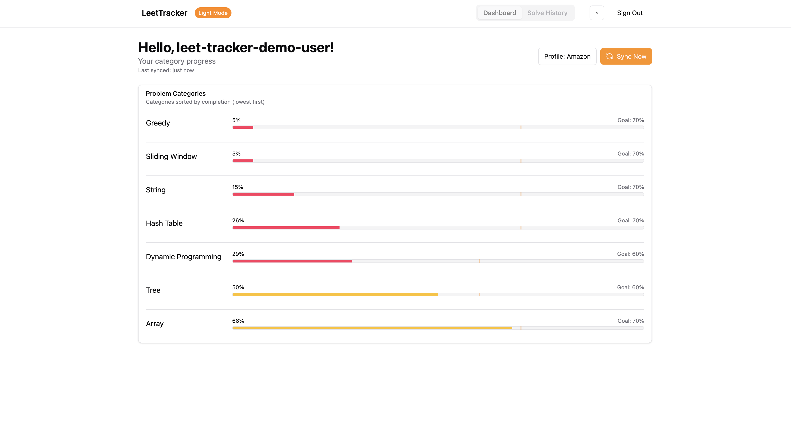
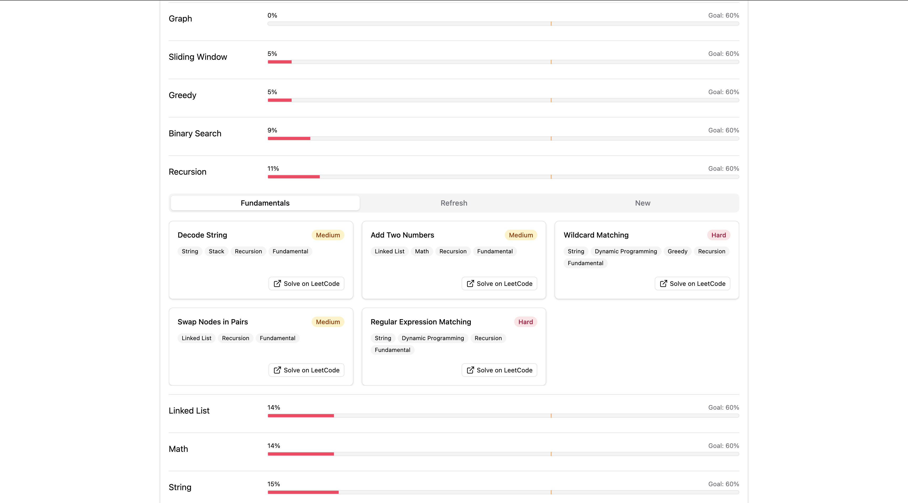
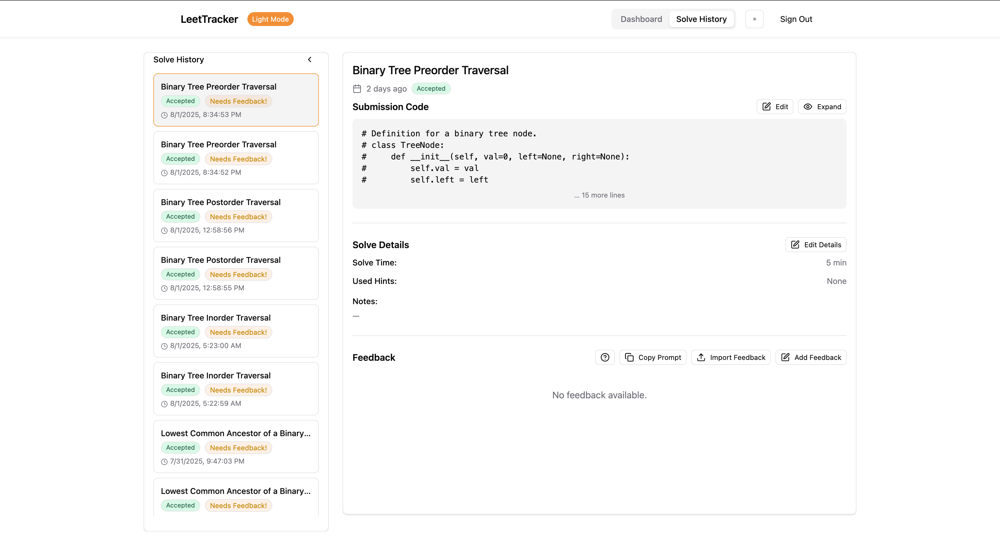
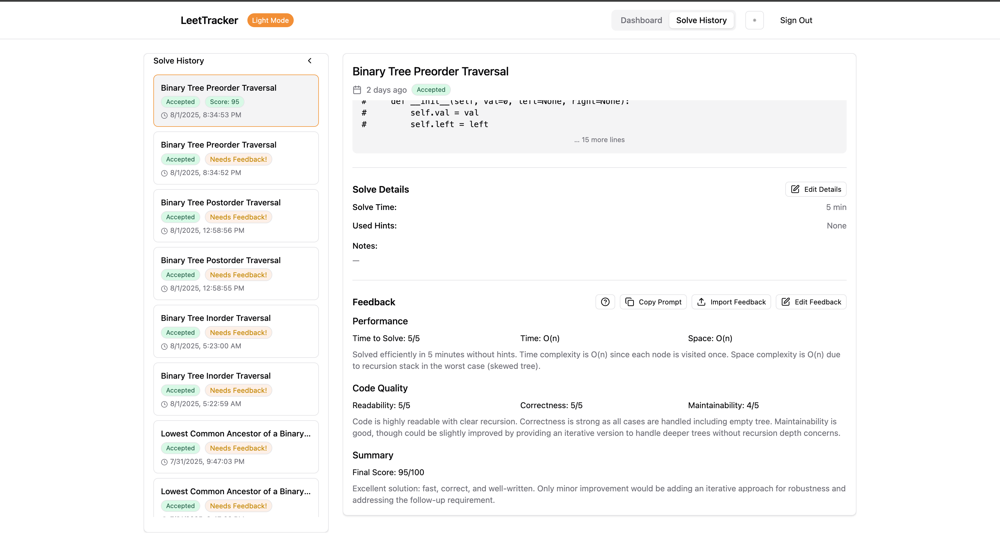

# LeetTracker

> A local-first app for tracking your LeetCode progress by category and getting smart, confidence-based problem recommendations.

## Why This Exists

LeetCode and other platforms are great for improving algorithm skills and learning the basics of these skills. However, I found it difficult to gauge my progress and identify which problems to solve next to improve my readiness for specific areas. This application was created with the goal to:

- Measure progress across problem categories (DP, Greedy, Sliding Window, Etc)
- Identify areas of weakness
- Recommend problems intelligently based on history, difficulty, and recency
- Track against custom or company-specific goals

## Key Features

- ✅ **Category-level scoring** with recency decay
- 🎯 **Goal profiles** (e.g. Amazon, Google, Custom)
- 📊 **Smart problem recommendations** (Fundamental, Refresh, New)
- 🔁 **Re-attempt logic** with diminishing returns
- 🔐 **Fully local-first** (data stored in IndexedDB)
- 🌙 **Dark mode** supported
- 🗂️ **Solve History & Detail view** with code, notes, hints, solve time, & timestamps
- 🤖 **One-click AI feedback**: copy a ChatGPT prompt, paste XML back, auto-parses & stores solve feedback

## Live App

Try the app here: [leet-tracker-log.vercel.app](https://leet-tracker-log.vercel.app/)

## Chrome Extension

To unlock full LeetCode history install the LeetTracker Chrome Extension:

👉 [Install on Chrome Web Store](https://chrome.google.com/webstore/detail/leettracker/aabfdphdfflecolneofmehajjmmpmgeg)

Once installed, the extension runs in the background while you're signed in to LeetCode, automatically syncing your full solve history with the app. This includes older submissions that are not available through the public API, enabling more accurate tracking and smarter recommendations.

## How It Works

### Data Flow

- ✅ **Problems:** Pulled from a daily-updated S3 file with likes/dislikes, tags, and popularity
- ✅ **Solves:** Pulled from public graphql api (most recent 20 solves) + Full history can optionally be pulled via the companion Chrome extension
- ✅ **Local Storage:** IndexedDB for user progress, settings, and sync timestamps
- ✅ **AI Feedback:** XML pasted from ChatGPT is parsed & stored alongside each solve

## Solve History & AI Feedback

Every submission appears in **Solve History** with rich details:

| Capability               | What it means                                                                                                                               |
| ------------------------ | ------------------------------------------------------------------------------------------------------------------------------------------- |
| **Code viewer / editor** | Expand or edit your submission inline.                                                                                                      |
| **Solve metadata**       | Store time-to-solve, hints used, personal notes. These are automatically captured and stored if the extension is installed.                 |
| **AI Feedback workflow** | 1. _Copy Prompt_ → paste into ChatGPT<br>2. Copy the XML it returns<br>3. _Import Feedback_ to auto-fill performance & code-quality scores. |

The feedback is validated client-side (range-checking 0-5 / 0-100) and immediately affects your category scores.

### Scoring Algorithm

Each category gets a confidence-weighted score:

```ts
estimatedScore = avg(quality * decay * difficultyWeight);
confidenceLevel = min(1.0, evidencePoints / 20);
adjustedScore = estimatedScore * confidenceLevel;
```

- **Decay:** Older solves contribute less (90-day half-life)
- **Difficulty weighting:** Easy < Medium < Hard
- **Attempt Penalty:** Diminishes score if multiple failed attempts before success.
- **Quality: Manually entered or GPT Calculated (Planned factor)**
- **Confidence:** Measures how much relevant recent evidence you have in a category. Maxes out at ~20 weighted solves.
- **Grouped Attempts:** Multiple attempts on the same problem within one day are grouped to avoid inflation.

You can read more about the scoring algorithm in the [Scoring Algorithm Deep Dive](docs/leet-tracker-scoring-doc.md).

### Recommendations

For each problem category:

- **Fundamentals:** Popular unsolved problems that help build foundational concepts
- **Refresh:** Past solves prioritizing low quality/time since last solved
- **New:** Unsolved, semi-random suggestions for practicing never-before-seen challenges

## Tech Stack

- **Frontend:** React + Vite + Tailwind
- **Storage:** IndexedDB (`idb`)
- **Data Source:** Public API data
- **Hosting:** Vercel (frontend), AWS (Lambda + S3 for metadata)

## Run Locally

```bash
# Clone the repository and install dependencies
git clone https://github.com/dmiska25/leet-tracker.git
cd leet-tracker
npm install

# Leetcode GraphQL API is proxied through a local server
# You'll need to sign in to vercel to run the local server and link your to the project
npx vercel login
npx vercel link
# Start the local server in another terminal
npx run dev:api

# Start the app
npm run dev
```

## Future Plans

- ✅ ~~Chrome extension now supports full solve history syncing~~
- ✅ ~~Visual timeline of solves across categories and problem tags~~
- Support for **exporting** solve history data (JSON format)
- Support for **importing** past solve history manually (upload-based or paste-in)
- General pattern feedback from multiple solves (e.g. "You tend to struggle with DP problems because of X" from GPT)

## Screenshots

Overview:



Recommendations:



Solve History:



Feedback:



## Contact Me

[GitHub](https://github.com/dmiska25) · [LinkedIn](https://www.linkedin.com/in/djmiska25/) · [Website](https://djmiska25.vercel.app/)

## License

This project is licensed under the [MIT License](LICENSE).
