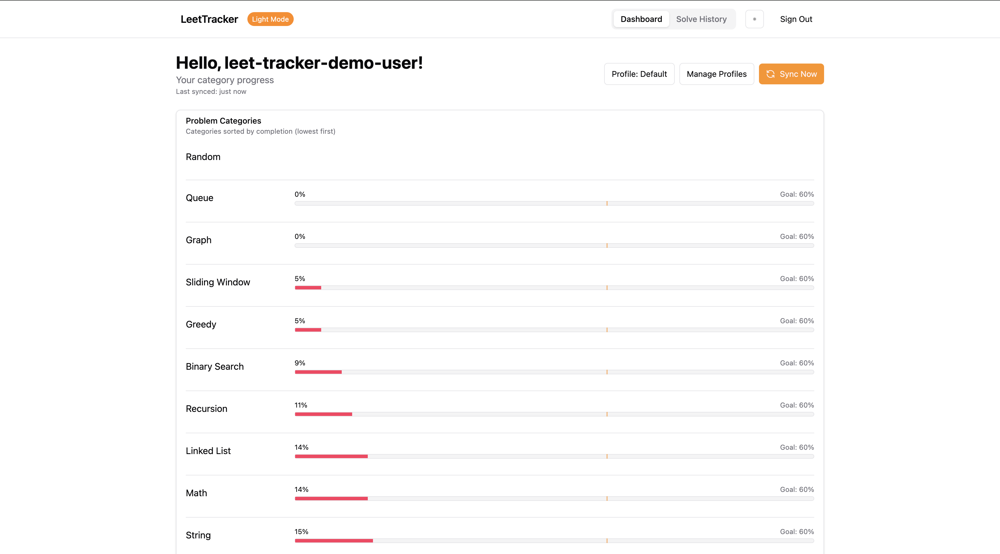

# LeetTracker

> A local-first app for tracking your LeetCode progress by category and getting smart, confidence-based problem recommendations.

## Why This Exists

LeetCode and other platforms are great for improving algorithm skills and learning the basics of these skills. However, I found it difficult to gauge my progress and identify which problems to solve next to improve my readiness for specific areas. This application was created with the goal to:

- Measure progress across problem categories (DP, Greedy, Sliding Window, Etc)
- Identify areas of weakness
- Recommend problems intelligently based on history, difficulty, and recency
- Track against custom or company-specific goals

## Key Features

- ✅ **Category-level scoring** with recency decay
- 🎯 **Goal profiles** (e.g. Amazon, Google, Custom)
- 📊 **Smart problem recommendations** (Fundamental, Refresh, New)
- 🔁 **Re-attempt logic** with diminishing returns
- 🔐 **Fully local-first** (data stored in IndexedDB)
- 🌙 **Dark mode** supported

## Live App

Try the app here: [leet-tracker-log.vercel.app](https://leet-tracker-log.vercel.app/)

## How It Works

### Data Flow

- ✅ **Problems:** Pulled from a daily-updated S3 file with likes/dislikes, tags, and popularity
- ✅ **Solves:** Pulled from `alfa-leetcode-api` (most recent 20 solves)
- ✅ **Local Storage:** IndexedDB for user progress, settings, and sync timestamps

### Scoring Algorithm

Each category gets a confidence-weighted score:

```ts
estimatedScore = avg(quality * decay * difficultyWeight);
confidenceLevel = min(1.0, evidencePoints / 20);
adjustedScore = estimatedScore * confidenceLevel;
```

- **Decay:** Older solves contribute less (90-day half-life)
- **Difficulty weighting:** Easy < Medium < Hard
- **Attempt Penalty:** Diminishes score if multiple failed attempts before success.
- **Quality: Manualy entered or GPT Calculated (Planned factor)**
- **Confidence:** Measures how much relevant recent evidence you have in a category. Maxes out at ~20 weighted solves.
- **Grouped Attempts:** Multiple attempts on the same problem within one day are grouped to avoid inflation.

You can read more about the scoring algorithm in the [Scoring Algorithm Deep Dive](docs/leet-tracker-scoring-doc.md).

### Recommendations

For each problem category:

- **Fundamentals:** Popular unsolved problems that help build foundational concepts
- **Refresh:** Past solves prioritizing low quality/time since last solved
- **New:** Unsolved, semi-random suggestions for practicing never-before-seen challenges

## Tech Stack

- **Frontend:** React + Vite + Tailwind
- **Storage:** IndexedDB (`idb`)
- **Data Source:** Public API data
- **Hosting:** Vercel (frontend), AWS (Lambda + S3 for metadata)

## Run Locally

```bash
git clone https://github.com/dmiska25/leet-tracker.git
cd leet-tracker
npm install
npm run dev
```

## Future Plans

- Chrome extension to pull a user's **full solve history** (beyond the latest 20)
- Visual timeline of solves across categories and problem tags
- Support for **exporting** solve history data (JSON format)
- Support for **importing** past solve history manually (upload-based or paste-in)

## Acknowledgments

- API data provided by [alfa-leetcode-api](https://github.com/alfaarghya/alfa-leetcode-api)

## Screenshots

Overview:



Recommendations:


## Contact Me

[GitHub](https://github.com/dmiska25) · [LinkedIn](https://www.linkedin.com/in/djmiska25/) · [Website](https://djmiska25.vercel.app/)

## License

This project is licensed under the [MIT License](LICENSE).
